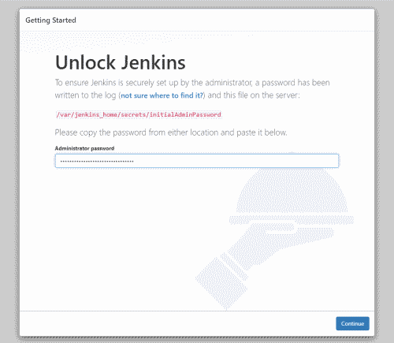

# 環境
硬體部分官方提到: RAM > 256NB，最好 2GB，空間留至少 10GB 放置 Docker 映像檔。
環境部分需要安裝 Java (8 或 11) 和 Docker
# 安裝 Docker
```bash
# 卸載舊的 docker
sudo apt-get remove -y docker docker-engine docker.io containerd runc

# 安裝必要的套件
# apt-transport-https 讓套件管理程式可以透過 https 協定使用 repo
sudo apt-get update
sudo apt-get install -y \
    apt-transport-https \
    ca-certificates \
    curl \
    gnupg \
    lsb-release

# 添加 Docker 官方 GPG key
curl -fsSL https://download.docker.com/linux/ubuntu/gpg | sudo gpg --dearmor -o /usr/share/keyrings/docker-archive-keyring.gpg

# 設置 stable 版本的 docker repository
echo \
  "deb [arch=amd64 signed-by=/usr/share/keyrings/docker-archive-keyring.gpg] https://download.docker.com/linux/ubuntu \
  $(lsb_release -cs) stable" | sudo tee /etc/apt/sources.list.d/docker.list > /dev/null
  
# 安裝 Docker Engine
sudo apt-get update
sudo apt-get install -y docker-ce docker-ce-cli containerd.io

# 下載測試 image 並執行，預期會得到輸出然後 container 就會結束
sudo docker run hello-world
```

# 執行 Jenkins
接著執行 Jenkins image，取得首次登入密碼
``` bash
# 拉最新的 docker image
docker pull jenkins/jenkins
# 建立 Jenkins 在 host 使用的目錄 /data/jenkins
sudo mkdir -p /data/jenkins
sudo chown -R $USER:$GROUP /data
# 執行 Jenkins
docker run \
    --name jenkins \
    -d --restart always \
    -p 8080:8080 -p 50000:50000 \
    -v /data/jenkins:/var/jenkins_home \
    jenkins/jenkins
# 取得初始登入密碼
cat /data/jenkins/secrets/initialAdminPassword
```

# 設定
打開 http://localhost:8080，輸入剛剛取得的密碼


接著選擇要安裝的 Plugin()，先從安裝建議的開始吧  


建立另一個管理員帳號   


指定這台機器的 URL，我這裡是 https://jenkins.tigernaxo.com


然後就完成拉！

# Reference
https://www.jenkins.io/doc/pipeline/tour/getting-started/
https://tso-liang-wu.gitbook.io/learn-ansible-and-jenkins-in-30-days/jenkins/jenkins/jenkins-scm-and-trigger