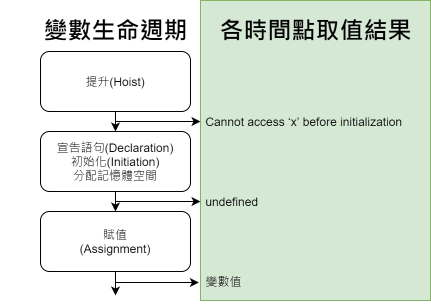

網路上時常見到充滿 function 與 var 的 JavaScript 求值題目，
筆者在釐清 Hoisting 和 TDZ 的觀念前時常覺得答案出乎意料，
雖然現在撰寫程式碼都已經避免使用 var，但是維護 legacy code 還是會用到，因此在這裡做個筆記。
# Hoisting
對學過伺服器端語言(C#、C/C++...)的人來說，預期試圖對未宣告的變數取值會出現 ReferenceError是很正常的事，
在 JavaScript 中也是如此：
```js
console.log(x) // ReferenceError: x is not defined
```
但 JavaScript 把 var 宣告變數放在後面，x 前面對 x 取值就變成 undefine，
在 JavaScript 當中對變數取值獲得 undefine 代表變數處於宣告後**已分配記憶體空間(初始化、initiation)**但**尚未賦值**的狀態，
但是明明 JavaScript 在宣告前就取值，怎麼能夠認得 x、而且知道 x 被初始化為 undefined 呢？
```js
console.log(x) // undefined
var x
```
原因在於 javascript 會先程式中的蒐集 var(let/const/function) 宣告並釐清對應的作用域，
最後再執行程式碼，這個行為就如同宣告被提升(Hoisting)到前面行數的程式碼中一樣。

JavaScript 跟傳統 OOP 語言一樣，在變數提升後、宣告初始化、賦值等等時機取用變數會獲得不同輸出結果，
這篇文章([link](https://www.iteye.com/blog/rednaxelafx-492667))中提到，
稱 JavaScript 為直譯式(解釋型)語言實際上是通俗的說法，語言本身沒有規定實現的方式(編/直譯)，
舉例來說 Chrome 瀏覽器所使用的 Google V8 JavaScript engine，
所帶的解釋器 (interpreter) 會將程式編譯 (compile) 成字節碼 (bytecode)，
最後再由編譯器 (compiler) 即時編譯 (JIT;just-in-time compilation) 編譯成機器碼執行，
而 JavaScript 被編譯時宣告會被蒐集到最頂端進行定義並區分作用域(scope)，這個行為就是 Hoisting
，記住重點在於**JS編譯後會先定義變數及區分作用域**，編譯後的程式看起來就像這樣：
```
在 global scope 定義變數 xxx
在 global scope 定義變數 xxx
在 global scope 定義函式 xxx
在 global scope 定義函式 xxx
在 xxx scope 定義變數 xxx
在 bbb scope 定義變數 xxx
在 abc scope 定義函式 xxx
開始執行程式碼：...
```

# Hoisting 有別
用 var、let、const、function 宣告變數或函式都會獲得提升，
但對於能否初始化、以及變數被歸類的作用域有所分別，
var 宣告的變數**會**被初始化為 undefined，而 let 與 const 的宣告**不會**被初始化為 undefined，
對比如下：
宣告方式 |作用域|提升時初始化|備註
----|----|----|----
var |global|有(undefined)|初始化為 undefined
let|locale|-|只有 let 宣告的變數會發生沒有被初始化的情況
const|locale|不需要|合法的 const 宣告本身就必須包含初始化
function|locale|不需要|直接以宣告的函式作為初始值

較常疏忽的一點：錯將 function expression 的賦值當成函式宣告(function declaration)，
兩者的差異：
- __function declaration__:
受惠於函式宣告，第1行 x 同時會被提升且初始化為函式，因此第一行可得到結果'x'；
  ```js
  console.log(x()) // 'x'
  function x(){
    return 'x'
  }
  ```
- __function expression__:
第2行以 function expression 得到的 function reference 作為右值賦值給 x，
x 提升的行為就像一般以 var 宣告的變數一樣，提升時只會被初始化為是 undefine 直到第2行才獲得賦值，
因此第2行後才能透過 x 呼叫所指涉的函示，下面第1行可看到時 x 是 undefined，第2行嘗試將 undefined 視為函式呼叫獲得錯誤：
  ```js
  console.log(x) // undefined
  console.log(x()) // Uncxught TypeError: x is not a function
  var x = function(){
    return 'x'
  }
  ```
# 執行環境 Execution Context
js 引擎開始執行程式碼時會建立一個**全域執行環境(Global Execution Content)**，內容包含：
- 全域物件(global object)
- 指向全域物件本身的指標 this
- 指向上層外部環境的參考 outer environment reference，但全域環境已是最外層
- 存放變數、函式的記憶體空間

而在瀏覽器當中 globel object 就等於 window，所以若是宣告於全域的變數或函式，會成為 global object 的屬性：
```js
// 瀏覽器中，window === global object:
console.log(this === window); // true

// 宣告於全域的變數或函式，會成為 global object (window)的屬性：
var a = 'a'
function f(){}
window.a
"a"
window.f
ƒ f(){}
```
當js引擎執行程式遇到**函式呼叫**時，會為函式建立函式所屬的執行環境，稱為**作用域環境(lexical environment)**，
而作用域執行環境也有屬於自己的物件、外部環境參考等等...
函式內的程式可以同時存取全域執行環境內的全域物件和作用域環境的物件，
而內層的作用域環境優先權在外層執行環境(例如：全域執行環境)之上，
這個現象稱為**執行堆疊 (Execution stack)**，
而程式藉由外部環境參考向外搜尋可用資源的過程像鍊條一般環環相扣稱為**範圍練 (Scope Chain)**。

在函式內宣告的 x 變數會作用範圍會被侷限在作用域環境內，
當函式執行時存取權會優先於全域執行環境中的 x 變數：
```js
function a() {
    // 使用 a 執行環境當中定義的 x
    var x = 'a';
    console.log(`a(): ${x}`);
    b();
}

function b() {
    // b 當中未定義 x 因此透過外部環境參考往外取得全域執行環境當中的 x
    console.log(`b(): ${x}`);
}
var x = 'x';
a();
// a(): a
// b(): x
```

執行環境的所屬階層是以函式建立的位置為準，
如果在最外層定義那麼外部環境參考就是指向 global object，
如果是函式內再定義函式，那麼內層函式的外部環境就是外層函式所創造的作用域環境：
```js
function a(){
    var x = 'a'
    function b(){
        // b 在 a 當中被定義，因此外層環境為 a，取 x 會變成 'a'
        console.log(`b(): ${x}`);
    }
    console.log(`a(): ${x}`);
    b()
}
var x = 'x';
a()
// a(): a
// b(): a
```

# 各時機取值
變數有生命週期，包含提升後(Hoisted)、宣告Declaration、初始化(分配記憶體空間)Initiation、賦值Assignment，
而在編譯器進行這些行為的時間點前後取值的結果是可以預測的：



附帶一提，對沒有宣告的變數取值會獲得 ReferenceError: x is not defined：
```js
console.log(x)
// ReferenceError: x is not defined
```

# Temporal Dead Zone
let/const 會發生提升，但 let 的提升不會初始化(分配記憶體空間)為 undefined，
剛剛提到 let 宣告會被提升到頂端但不會初始化，
所以在**提升位置**到**宣告語句**(不是~~賦值~~喔)中間的區域如果對取值會發生錯誤，
這個區域稱為**暫時性死區(TDZ;Temporal Dead Zone)**：
```js
function a(){
  // a 被編譯器提升到這裡(作用域環境的頂端)，a 的 TDZ 從這裡開始...
  console.log(a) // TDZ 區域中，a只有被宣告而未被初始化，所以得到錯誤，可參考參照取值結果表
  let a  // a 的 TDZ 結束
  a = 10
}
a()
// Uncaught ReferenceError: Cannot access 'a' before initialization...
```
我們可以在宣告之後取值做測試，a 的確被初始化為 undefined：
```js
function a(){
  // a 的 TDZ 從這裡開始...
  let a  // 這裡 a 初始化成為 undefined
  console.log(a)
  a = 10
} 
a()
// undefined
```
# Note
- [Medium - Javascript執行環境 (Execution Context)簡介](https://medium.com/digital-dance/javascript%E5%9F%B7%E8%A1%8C%E7%92%B0%E5%A2%83-execution-context-%E7%B0%A1%E4%BB%8B-672185ed6bf4)
- [TechBridge 技術共筆部落格 - 我知道你懂 hoisting，可是你了解到多深？](https://blog.techbridge.cc/2018/11/10/javascript-hoisting/)
- [MSDN - Hoisting](https://developer.mozilla.org/en-US/docs/Glossary/Hoisting)
- [虚拟机随谈（一）：解释器，树遍历解释器，基于栈与基于寄存器，大杂烩](https://www.iteye.com/blog/rednaxelafx-492667)
- [Hoisting in JavaScript](https://john-dugan.com/hoisting-in-javascript/)
- [JavaScript and the Inner Workings of your Browser](https://softwareengineeringdaily.com/2018/10/03/javascript-and-the-inner-workings-of-your-browser/)