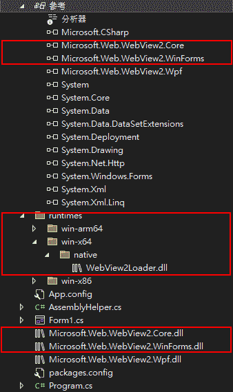

有些部屬環境要求能單一執行檔，如果要使用自己的 DLL 就會有問題，研究了內嵌 DLL 的作法應用於 WebView2 專案上。  
以 .NET Framework 4.7.2 的 WinForm 專案為例，目標環境為 windows x64。
## Dependency
1. 安裝 Nuget 上的 Microsoft.Web.WebView2。
2. 把這些資料夾底下的 Dll 複製到專案資料夾下，並加入版控
    - `packages\Microsoft.Web.WebView2.1.0.1823.32\runtimes`
    - `packages\Microsoft.Web.WebView2.1.0.1823.32\lib\net45`  
3. 參考移除上述 Dll 參考(移除 Nuget 參考)，改直接參考專案資料夾下的 Dll。  
    

4. 把參考的 Dll 調整為內嵌資源  
    
## AssemblyHelper.cs
```c#
public class AssemblyHelper
{
  public string Name
  {
    get
    {
      return this.assembly.GetName().Name;
    }
  }
  public string AppDataPath { get; set; }
  private Assembly assembly;

  public AssemblyHelper()
  {
    assembly = Assembly.GetCallingAssembly();
    AppDataPath = Environment.GetFolderPath(Environment.SpecialFolder.ApplicationData);
    AppDataPath = Path.Combine(AppDataPath, Name);
  }

  /// <summary>
  /// Extract embeded dll to target path
  /// </summary>
  /// <param name="resourceName">Dll embed path</param>
  /// <param name="targetPath">Dll extract distination</param>
  public void ExtractEmbeddedDLL(string resourceName, string targetPath)
  {
    var targetDir = Path.GetDirectoryName(targetPath);
    if (!string.IsNullOrEmpty(targetDir) && !Directory.Exists(targetDir)) Directory.CreateDirectory(targetDir);

    using (Stream resourceStream = assembly.GetManifestResourceStream(resourceName))
    {
      using (FileStream fileStream = new FileStream(targetPath, FileMode.Create))
      {
        resourceStream.CopyTo(fileStream);
      }
    }
  }

  /// <summary>
  /// 設置解析組件路徑的事件處理常式
  /// </summary>
  public void EnableEmbededManifestDll() => AppDomain.CurrentDomain.AssemblyResolve += OnResolveAssembly;
  
  /// <summary>
  /// Assembly 解析行為
  /// </summary>
  /// <param name="sender"></param>
  /// <param name="args"></param>
  /// <returns></returns>
  public static Assembly OnResolveAssembly(object sender, ResolveEventArgs args)
  {
    Assembly assembly = Assembly.GetCallingAssembly();

    string project = Assembly.GetEntryAssembly().GetName().Name;
    string manifestItem = $"{project}.{new AssemblyName(args.Name).Name}.dll";
    using (Stream stream = assembly.GetManifestResourceStream(manifestItem))
    {
      if (stream == null) return null;

      byte[] assemblyRawBytes = new byte[stream.Length];
      stream.Read(assemblyRawBytes, 0, assemblyRawBytes.Length);
      return Assembly.Load(assemblyRawBytes);
    }
  }
}
```
## Program.cs
```C#
internal static class Program
{
  [STAThread]
  static void Main()
  {
    try
    {
      var asm = new AssemblyHelper();
      // Load an extracted DLL dynamically
      asm.EnableEmbededManifestDll();

      var loaderDllFolderPath = Path.Combine(asm.AppDataPath, "runtimes\\win-x64\\native");
      var dll = Path.Combine(loaderDllFolderPath, "WebView2Loader.dll");
      var loaderDllEmbedPath = $"{asm.Name}.runtimes.win_x64.native.WebView2Loader.dll";
      asm.ExtractEmbeddedDLL(loaderDllEmbedPath, dll);

      // 將需注入 DLL 的邏輯抽離 Main 才能跑
      run(loaderDllFolderPath);
    }
    catch (Exception ex)
    {
      MessageBox.Show(ex.Message);
    }
  }
  private static void run(string loaderDllFolderPath)
  {
    CoreWebView2Environment.SetLoaderDllFolderPath(loaderDllFolderPath);

    Application.EnableVisualStyles();
    Application.SetCompatibleTextRenderingDefault(false);
    Application.Run(new Form1());
  }
}
```
## 隱藏暫存檔
假設 webview2 元件變數是`wv`：
```c#
private async Task showWeb(string url) {

  // 重設網頁暫存檔案位置
  var asm = new AssemblyHelper();
  var webView2DataPath = Path.Combine(asm.AppDataPath, $"webview2");
  Directory.CreateDirectory(webView2DataPath);
  var webView2Environment = await CoreWebView2Environment.CreateAsync(null, webView2DataPath);

  await wv.EnsureCoreWebView2Async(webView2Environment);
  wv.CoreWebView2.SetVirtualHostNameToFolderMapping("appdata", webView2DataPath, CoreWebView2HostResourceAccessKind.Allow);
  wv.Source = new Uri(url);

}
```

## 部屬
編譯之後可以直接部屬單一 exe 檔案(其他產生的 dll 檔案不用理會)，這個做法也不會在執行黨所在資料夾留下瀏覽器暫存檔。