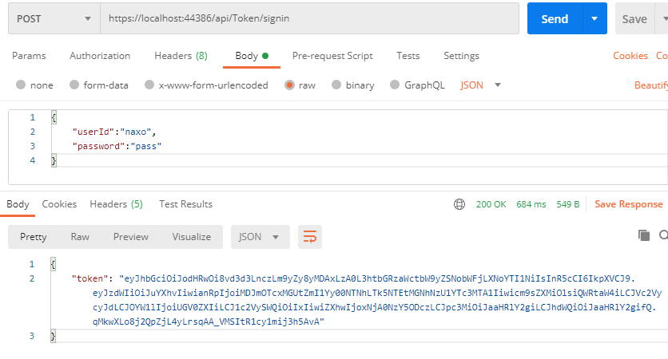

# SignalR驗證方式
SignalR 的授權可以選擇使用 Cookie 或 Bearer Token：
- Cookie: 驗證方法與一般網頁別無二致，較容易實作但缺點是只能用於瀏覽器(browser-specific)。
- Bearer Token 可通用於網頁和 App (或提供任何應用程式)，使用 Token 做登入能夠讓應用程式更容易實作其他使用者端，如果有其他的伺服器簽發 Token，更容易整合至單一登入(Single Sign-On)，也是官方建議使用的方式，以下假設簽發 Token 與 SignalR 伺服器為同一台進行實作。

將 Token 驗證實作至伺服器之前，讓我們先練習實作一支簽發 Token 的 API。

# 以 Option pattern 取得 JWT 設定
這裡練習 Option pattern，以獲取 appsetting.json 當中 JWT 相關設定的強型別支援：

## appsetting.json
將 JWT 相關的設定寫到 appsetting.json 當中：

{
  "Logging": {
    "LogLevel": {
      "Default": "Information",
      "Microsoft": "Warning",
      "Microsoft.Hosting.Lifetime": "Information"
    }
  },
  "JWT": {
    "Issuer": "Naxo",
    "Expires": "1440", // 憑證有效分鐘數
    "SignKey": "myNameIsTigernaxo,ThisIsMyPersonalBlog" // 設定簽發/解密憑證的對稱式加密金鑰
  },
  "AllowedHosts": "*"
}


## JWT Option 類別
建立 Options.cs ，並在當中新增一個 Option 類別以對應 JWT 設定：

namespace SignalR
{
    public class JWTOption
    {
        public const string JWT = "JWT";
        public string Issuer { get; set; }
        public string SignKey { get; set; }
        public int Expires { get; set; }
    }
}


## 註冊服務容器
在 Startup.cs 的 ConfigureServices 將 JWTOption 註冊到 service container 當中，之後可以直接注入 Controller 使用；

public void ConfigureServices(IServiceCollection services)
{
    services.AddControllers();
    services.AddSignalR();

    // 在 service container 當中註冊 JWT Option
    services.AddOptions<JWTOption>()
        .Bind(Configuration.GetSection(JWTOption.JWT));
}


# 簽發 Token
## 安裝 Token 套件
筆者在 ASP .NET Core 3.1 的 Web API 專案後，無法直接使用 JWT 相關功能，所以必須先安裝套件：
```shell
dotnet add package System.IdentityModel.Tokens.Jwt --version 6.8.0
```
## Login Controller
建立 API 控制器 `Controllers/TokenController.cs`，並注入 `IOptions<JWTOption>`：
```csharp
using System;
using System.Collections.Generic;
using System.IdentityModel.Tokens.Jwt;
using System.Linq;
using System.Security.Claims;
using System.Text;
using System.Threading.Tasks;
using Microsoft.AspNetCore.Authorization;
using Microsoft.AspNetCore.Http;
using Microsoft.AspNetCore.Mvc;
using Microsoft.Extensions.Configuration;
using Microsoft.Extensions.Configuration.UserSecrets;
using Microsoft.Extensions.Options;
using Microsoft.IdentityModel.Tokens;

namespace SignalR.Controllers
{
    [Route("api/[controller]")]
    [ApiController]
    public class TokenController : ControllerBase
    {
        private JWTOption _jwtOpt;
        // 等待服務容器注入 IOptions<JWTOption>
        public TokenController(IOptions<JWTOption> jwtOpt)
        {
            this._jwtOpt = jwtOpt.Value;
        }

        [AllowAnonymous]
        [HttpPost("signin")]
        public IActionResult SignIn(LoginModel loginModel)
        {
            // 模擬驗證使用者帳號密碼
            var canLogin = loginModel.userId == "naxo" && loginModel.password == "pass";
            if (canLogin)
            {
                string issuer = _jwtOpt.Issuer;
                string signKey = _jwtOpt.SignKey;

                // 設定要加入到 JWT Token 中的聲明資訊(Claims)
                List<Claim> claims = new List<Claim>();

                // 加入Sub(用戶)
                claims.Add(new Claim(JwtRegisteredClaimNames.Sub, loginModel.userId));
                // 加入jti(JWT ID) 用於一次性 token
                //claims.Add(new Claim(JwtRegisteredClaimNames.Jti, Guid.NewGuid().ToString()));

                // 聲明使用者 userId、roles 的 claim，這裡會用來判斷使用者識別碼、使用者群組
                claims.Add(new Claim("userId", loginModel.userId));
                claims.Add(new Claim("roles", "Admin"));
                claims.Add(new Claim("roles", "Users"));

                // 建立一組對稱式加密金鑰，主要用於 JWT 簽章之用
                SymmetricSecurityKey securityKey = new SymmetricSecurityKey(Encoding.UTF8.GetBytes(signKey));
                // 定義加密金鑰、演算法、數位簽章摘要
                // HmacSha256 必須大於 128 bits，亦即 key 長度至少要 16 字元
                SigningCredentials signingCredentials = new SigningCredentials(securityKey, SecurityAlgorithms.HmacSha256Signature);

                // 產生一個 JwtSecurityToken
                var token = new JwtSecurityToken(
                        issuer,  // Issuer    
                        issuer,  // Audience    
                        claims,  // claims
                        expires: DateTime.Now.AddMinutes(_jwtOpt.Expires), // token 生效至過期的分鐘數
                        signingCredentials: signingCredentials
                        );
                // 序列化 JwtSecurityToken
                var jwt_token = new JwtSecurityTokenHandler().WriteToken(token);

                // 回傳 token
                return Ok(new
                {
                    token = jwt_token,
                });
            }
            // 驗證失敗
            return BadRequest(new
            {
                err = "登入失敗",
            });
        }
    }
    public class LoginModel
    {
        public string userId { get; set; }
        public string password { get; set; }
    }
}
```

# 測試
至此我們已完成了一個簡易的 Token SignIn API，以 Postman 進行測試：


# 備註
- 驗證使用者帳號/密碼的區段需自行代換成應用程式需要的程式碼。
- Token 當中的 Claim 可視情況自行增減