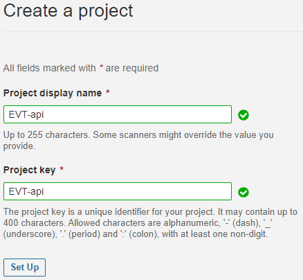
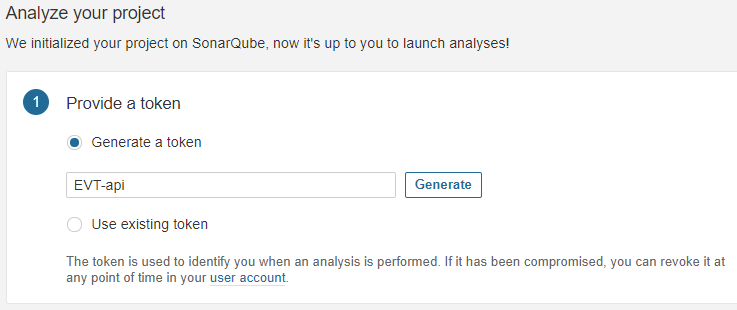
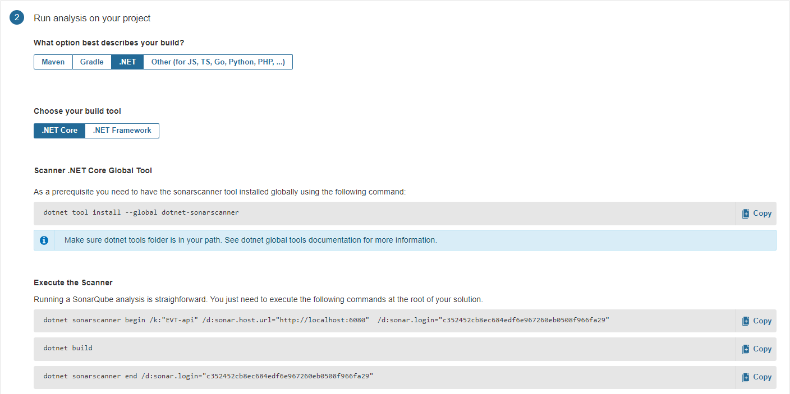
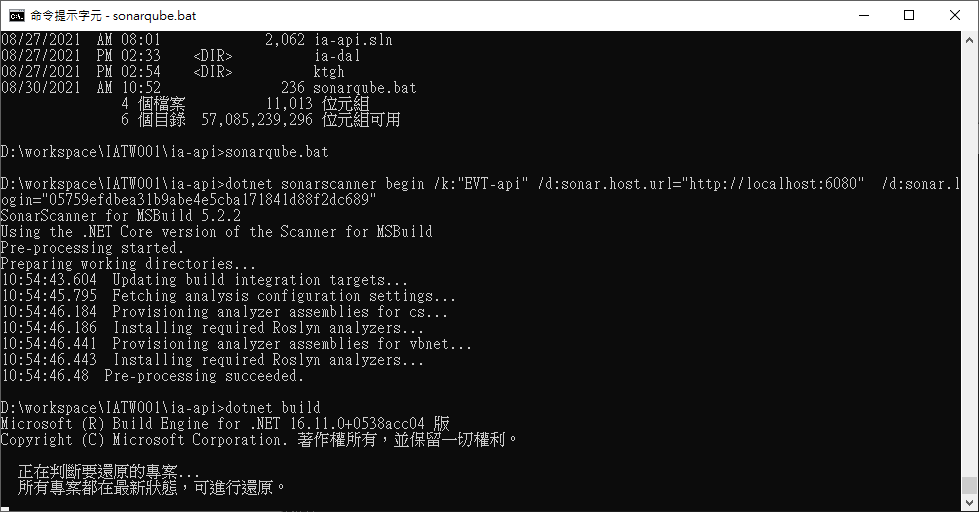
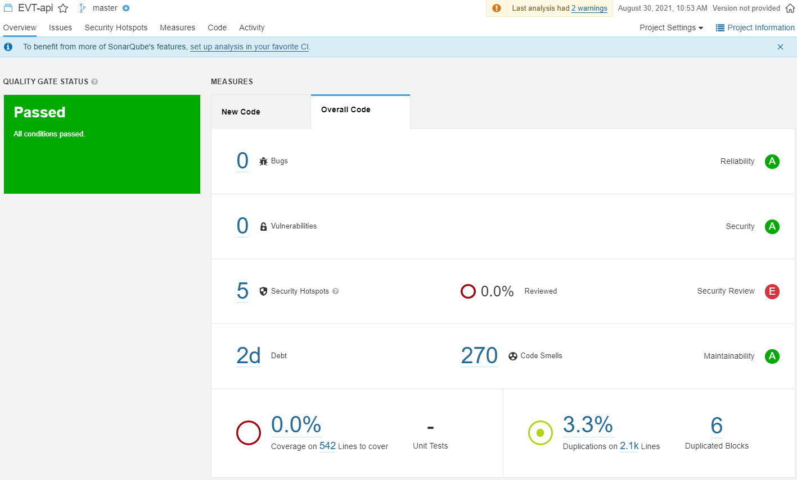

弱點掃描時常使用 owasp top 10 作為報告，
然而 owasp 軟體一年要價不菲，委外掃一次也是非常貴，
使用免費的 SonarQube 將弱點掃描整合到 CI/CD 階段，
要交付前再花錢委外掃一次似乎是個折衷的作法，避免一次檢測出來的弱點過多改動過大。

SonarQube 分為兩個部分 SonarQube Server、Scanner (Client 端程式)。
Scanner 負責進行掃描並將結果上傳 Server，
而 Server 作為負責處理和儲存分析報告的 compute engine 會分析上傳的結果，
並提供 Web 使用者介面、搜尋功能，因此分析完成後就可以直接在 Web 上查看報告，
Scanner 除了能夠在 locale 端使用，還能直接整合到 CI/CD Server 上進行程式碼品質掃描。
雖說可以拿 localhost 直接作為 Server 使用，
這裡還是紀錄如何在虛擬機器上實際安裝 SonarQube，
以後在實際機器上安裝就可以作為參考，

# 準備 Linux Server
## 硬體
個人使用或小規模的團隊在一台機器上安裝就足夠使用了，
如果需要架設提供大量服務的伺服器，官網也提供 Cluster 的安裝方式方便做 Loading Balance。

這裡紀錄在一台 Ubuntu 20.04 上架設。
關於 Linux 安裝過程在這裡不加贅述，
官方提到硬體有幾個注意事項，對現代的硬體來說其實都還好，比較要注意的是硬碟空間：
 - RAM 至少要 2G；free RAM 至少要 1G (所以用 Windows server 就要準備大很多喔)。
 - 上傳報告需要一定的空間，因次對硬碟的空間與效能有一定的要求，不夠的話容易太慢。
 - server side 不支援 32-bit 作業系統；但 Scanner 可以支援 32-bit systems。
## 安裝 OpenJDK 11
```bash
sudo apt update
sudo apt upgrade
sudo apt install openjdk-11-jdk
# 確認 java 版本
java --version
```
然後在 `.bashrc` 裡面把 Java 添加到 PATH 變數上。
## 安裝 PostgreSQL 13
```bash
#添加 apt-key
wget --quiet -O - https://www.postgresql.org/media/keys/ACCC4CF8.asc | sudo apt-key add -
echo "deb http://apt.postgresql.org/pub/repos/apt/ `lsb_release -cs`-pgdg main" |sudo tee  /etc/apt/sources.list.d/pgdg.list
sudo apt update
# 安裝資料庫
sudo apt install postgresql-13 postgresql-client-13
systemctl status postgresql.service #查看 postgresql 服務狀態
```
設置密碼
```sql
$ sudo -u postgres psql
# create database sonarqube; -- 建立資料庫
CREATE DATABASE
# create user sonarqube with encrypted password 'mypass'; -- 建立資料庫使用者和密碼
CREATE ROLE
# grant all privileges on database sonarqube to sonarqube; -- 設定資料庫權限
GRANT
# EXIT;
```
如果資料庫和 SonarQube Server 不在同一台機器上，
必須透過網路連線則要設定監聽、白名單設定檔：
```bash
# /etc/postgresql/13/main/postgresql.conf
# 監聽所有位址連線
listen_addresses = '*'
# 或是只監聽特定 IP 的連線
listen_addresses = '192.168.10.11'
```
```bash
# /etc/postgresql/13/main/pg_hba.conf
# 所有連線都視為白名單
host all all 0.0.0.0/0 md5
# 或是只將特定的 IP 加為白名單
host all all 10.10.10.0/24 md5
```
## 調整 Linux 限制
SonarQube 對於 Linux 作為 Server 有下面的要求：
 - vm.max_map_count >= 524288
 - fs.file-max >= 131072
 - SonarQube user 可開啟的 file descriptors >= 131072 
 - SonarQube user 可開啟的 threads >= 8192

首先查看 Ubuntu 20.04 的預設限制，發現只需要調整 vm.max_map_count 和 ulimit -n 
```bash
sysctl vm.max_map_count # 65530
sysctl fs.file-max # 9223372036854775807
ulimit -n # 1024
ulimit -u #15392
```
進行調整，附上其他參數的調整方法：
```bash
sudo sysctl -w vm.max_map_count=524288
#sudo sysctl -w fs.file-max=131072
#ulimit -n 131072
ulimit -u 8192
```
上面的調整都是只對使用者登入階段暫時發生作用，
因此另外新增 conf 文件為使用者 sonarqube 預設解除限制：
```bash
# /etc/sysctl.d/99-sonarqube.conf
sonarqube   -   nofile   131072
sonarqube   -   nproc    8192
```

## 安裝 SonarQube Server 9.0.1
### 下載 Server 端程式
先從[這裡](https://www.sonarqube.org/downloads/)找到下載連結，
我下載的是 Community 最新版本。
```bash
# 下載
wget https://binaries.sonarsource.com/Distribution/sonarqube/sonarqube-9.0.1.46107.zip
# 解壓縮
unzip sonarqube-9.0.1.46107.zip
```
### 設置
修改檔案 `$SONARQUBE-HOME/conf/sonar.properties`，
設定 PostgreSQL 資料庫的連線，
使用者名稱為 sonarqube，密碼 mypass， 使用的資料庫 sonarqube
```bash
# 資料庫設置
sonar.jdbc.username=sonarqube
sonar.jdbc.password=mypass
sonar.jdbc.url=jdbc:postgresql://localhost/sonarqube

# 設置 Elasticsearch data 存放位址
sonar.path.data=/var/sonarqube/data
sonar.path.temp=/var/sonarqube/temp
```
### 設定密碼
嘗試啟動 SonarQuebe Server
```bash
bin/linux-x86-64/sonar.sh start
```

因為我是用連接埠轉送到虛擬機的9000，所以我打開的網址是 `http://127.0.0.1:8090`，
如果在本地機器上執行就是打開 `http://localhost:9000`，
開啟後一開始會看到 SonarQube is starting，
需要等待一下下就會出現登入畫面，
用 admin/admin 登入後會馬上要求重設密碼。

### 設置開機啟動
新增一個 service 檔案 `/etc/systemd/system/sonarqube.service`
```
[Unit]
Description=SonarQube Server

[Service]
Type=simple
ExecStart=/bin/bash /pkg/sonarqube-9.0.1.46107/bin/linux-x86-64/sonar.sh start
ExecStop=/bin/bash /pkg/sonarqube-9.0.1.46107/bin/linux-x86-64/sonar.sh stop
ExecReload=/bin/bash /pkg/sonarqube-9.0.1.46107/bin/linux-x86-64/sonar.sh restart
Restart=always
LimitNOFILE=131072
LimitNPROC=8192

[Install]
WantedBy=multi-user.target
```
設置開機啟動
```
sudo systemctl enable sonarqube.service
```
# 安裝 Scanner
還沒有將 SonarQube 整合進 CI/CD 流程的需求之前，
可以採取的方式是開發進行到一個階段在程式開發機掃描程式碼，
再將結果上傳到 SonarQube Server，
因為我的 .NET Core 開發環境是 Visual Studio 2019，
所以 Scanner 安裝於 Windows 10 上。

> P.S.因為這裡的情境是在開發機上做分析，
因此前提假設機器上已經安裝相應的 dotnet sdk，
我是裝 3.1。

#### 安裝 dotnet sonarscanner
```
dotnet tool install --global dotnet-sonarscanner
```
#### 安裝 JRE 11
到 Java 網站上抓 JRE 11安裝，這裡一樣要確認系統環境變數新增，
新增 `JAVA_HOME` 系統變數，值為 `C:\Program Files\Java\jdk-11.0.12`
## 進行分析
從 SonarQube Web 介面新增一個專案，分析方式選擇 Locally：


建立一個分析專案，上面是專案名稱，
下面填入跟其他專案不重複的 project key (這裡我還是用專案名稱)。


設置一組 Token 提供 local 端分析完畢後可以上傳報告：


專案分析設置，設置 `.NET`、`.NET Core`，


設置玩畢下面會自動出現程式碼，
第一個區塊是要求先安裝剛剛安裝過的工具 dotnet-sonarqube 所以不需要理會，
第二個區塊共有三行程式碼，
把它複製起來貼到檔案 `sonarqube.bat`，然後把檔案放在要分析的專案資料夾底下。
```bat
dotnet sonarscanner begin /k:"EVT-api" /d:sonar.host.url="http://localhost:6080"  /d:sonar.login="05759efdbea31b9abe4e5cba171841d88f2dc689"
dotnet build
dotnet sonarscanner end /d:sonar.login="05759efdbea31b9abe4e5cba171841d88f2dc689"
```

最後打開小黑窗，切換到專案所在的工作目錄，執行這個 bat 檔案，
接個 scanner 就會對程式碼進行分析、將結果上傳 SonarQube Server。
```bat
sonarqube.bat
```
執行開始到完成大概長這樣：


## 檢視結果
點選專案會呈現總覽頁面，就可以知道問題出在哪然後點選在意的看。

如果需要客製化的報表，
可以使用 API 抓取資料再將資料用自己的方式呈現，
在此暫不詳述。
## 版本控制
再進行一次分析，會把新的程式碼有那些問題列出來，舊的程式碼有那些問題未改善
## 不需要執行的事項
 - Adding the JDBC Driver: 因為是使用 Postgresql，用內建的就好。
# Referecne
- [SonarQube](https://www.sonarqube.org/)
- [SonarQube GitHub](https://github.com/SonarSource/sonarqube)